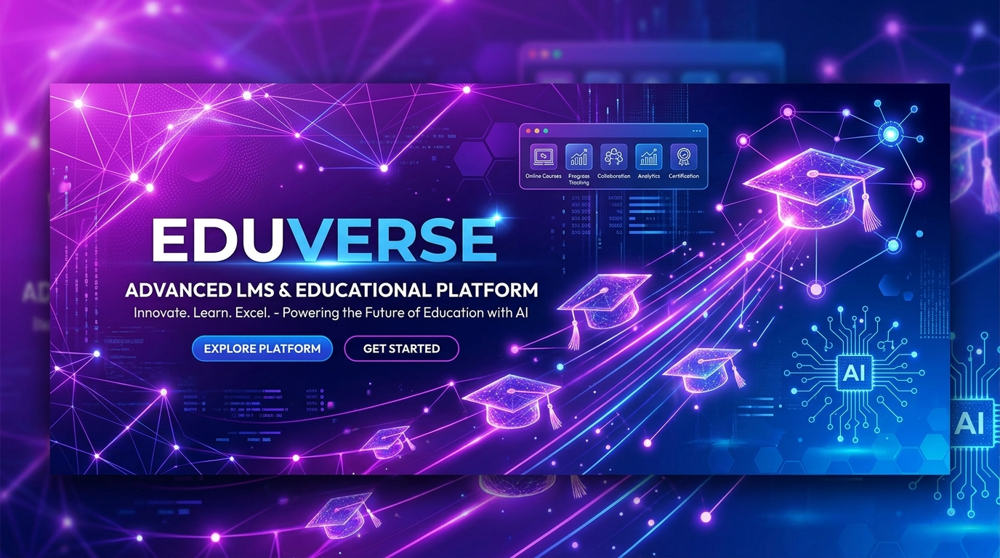

<div align="center">
  
  
  # 🎓 EduLink - Modern Full-Stack LMS & Educational Platform
  
  <p>A state-of-the-art Learning Management System (LMS) designed for modern digital classrooms.</p>

  
  
  
  
  
</div>

---

## ✨ Overview

EduLink bridges the gap between students and educators with cutting-edge tools. Built with a robust Laravel API backend and a blazing-fast React + Vite frontend, it integrates real-time communications, video meetings, and an interactive AI learning assistant.

## 🚀 Key Features

- 🤖 **AI Learning Assistant**: Integrated AI tutor for instant academic questions & automated quiz generation.
- 📹 **Live Video Meetings**: Video conference support for online classes and virtual office hours.
- 📝 **Assignments & Quizzes**: Interactive quiz builder, real-time grading, and digital file submissions.
- 💬 **Real-time Chat**: Group chat rooms and direct messaging using our high-speed WebSocket service.
- 📱 **Mobile Native Ready**: Capacitor configuration included for building native Android & iOS apps.

## 🛠️ Setup & Running

### Backend (Laravel)
```bash
cd backend
composer install
cp .env.example .env
php artisan key:generate
php artisan migrate --seed
php artisan serve
```

### Frontend (React + Vite)
```bash
cd frontend
npm install
npm run dev
```

---
<div align="center">
  <b>Developed with ❤️ by <a href="https://github.com/shetesfa">shetesfa</a></b>
</div>
